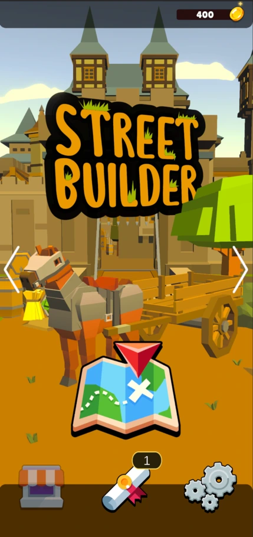
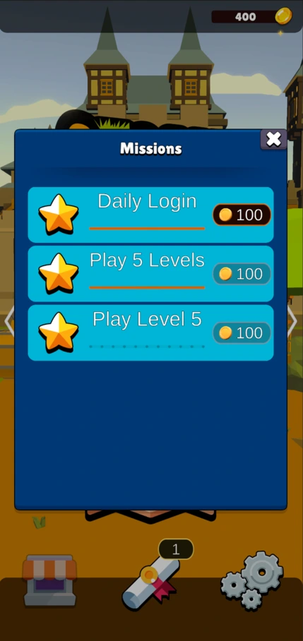
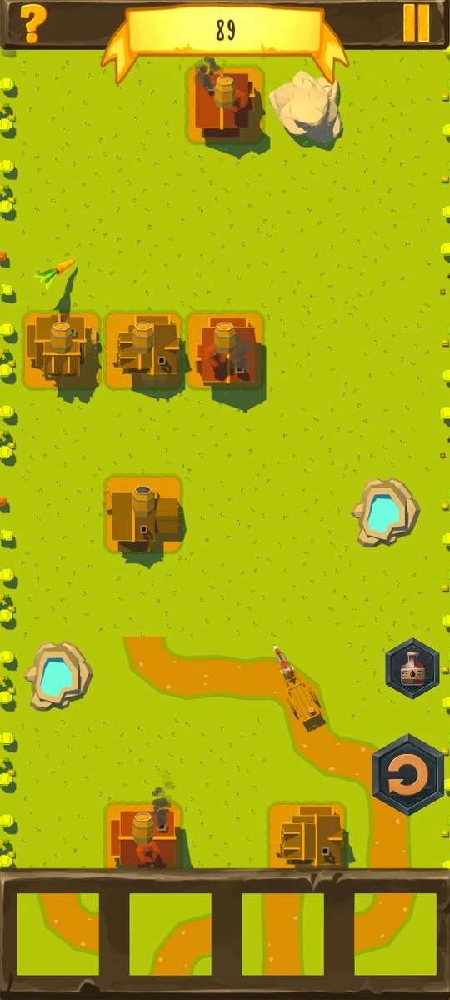
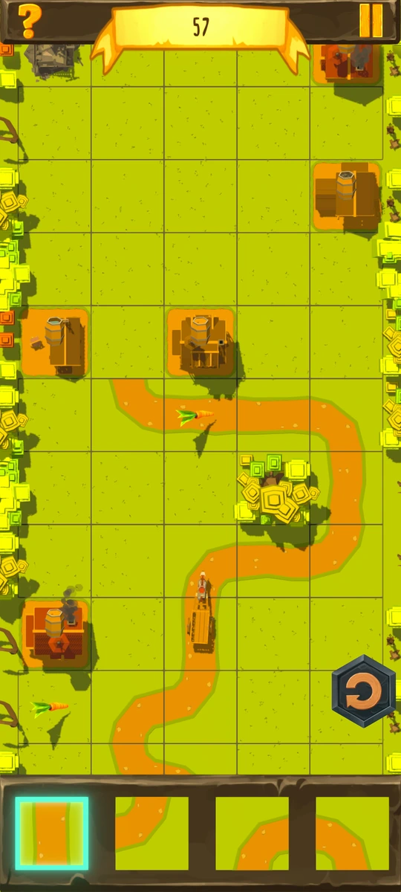

# Street Builder

The player must guide his carriage to the end of the randomly generated level using prefabricated road parts and collect as many stars as possible in the process.

    Key aspects:

        - Made with Unity 2020.3.10f1
        - Procedural generated levels
        - Developed for Android

https://github.com/user-attachments/assets/b66e1168-21d3-4c8b-bd16-63ccf1bdfad0

# Content

## Main Menu

In the main menu, players can select their current carriage, view the active [missions](#missions) and make changes in the settings menu.
New carriages can be bought for gold, which can be earned by completing levels and missions.

### Missions

An overview of the current missions. Some of them can be repeated after a certain time. Completing a quest rewards the player with gold, which he can use to buy new carriages, for example.

## Gameplay

The level consists of square fields, which are generated row by row. Empty squares or obstacles are placed at random, but at least one path through the level is guaranteed. The number of obstacles and the length of the level scale with the current level number.
The player receives a random selection of road sections, which he can place on the empty spaces. As soon as the first road has been placed, the carriage sets off. If it reaches the end of the road, the player loses. If the player manages to bring the carriage safely to its destination, he wins.
3 stars are placed in the level which the player can collect to earn more gold at the end.
If the player drives his carriage over a randomly placed carrot, he slows down the carriage and thus gains a little more time to build the road.

Normal game view.

The grid is visible as long as the player has a street section selected.

# Code samples

## Level Builder [(View Script)](scripts/LevelBuilder.cs)

This script builds the level at the beginning of the game.
If the endless mode is activated, the level is built row by row, depending on the position of the player.

## Player Controller [(View Script)](scripts/PlayerController.cs)

Allows the player to place road sections and move the camera through the level.
Originally there were powerups, which were also controlled here. For example, destroying obstacles, slowing down time and a new selection of road sections.

## Tile Selection [(View Script)](scripts/TileSelection.cs)

The Tile Selection provides the player with a random selection of road sections which they can use to build their road. It also ensures that the same section does not appear too often in a selection. The player can completely renew the selection at certain intervals. If a road is placed, a new one is added to the selection.

## Missions

### MissionManager [(View Script)](scripts/MissionManager.cs)

The Mission Manager handles all active missions. The save the current state of the missions i used the [Easy Save](https://assetstore.unity.com/packages/tools/utilities/easy-save-the-complete-save-game-data-serializer-system-768) asset.

### Mission [(View Script)](scripts/Mission.cs)

The base class for all missions. It inherits from ScriptableObject so i can create new missions in the editor.